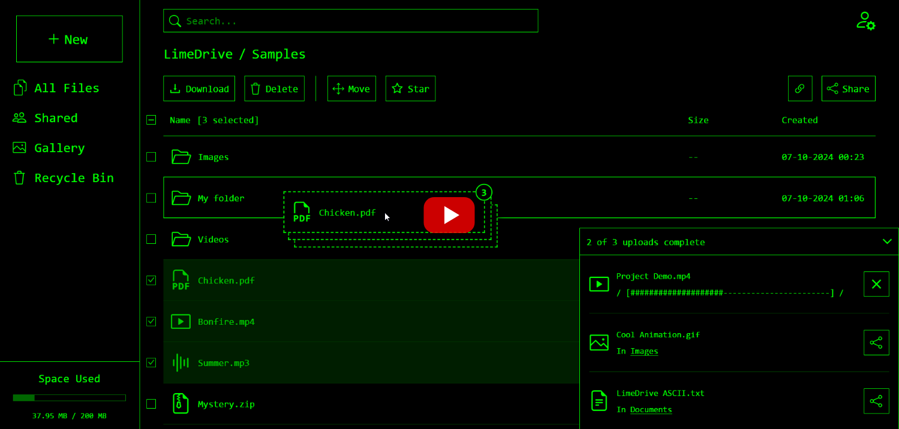
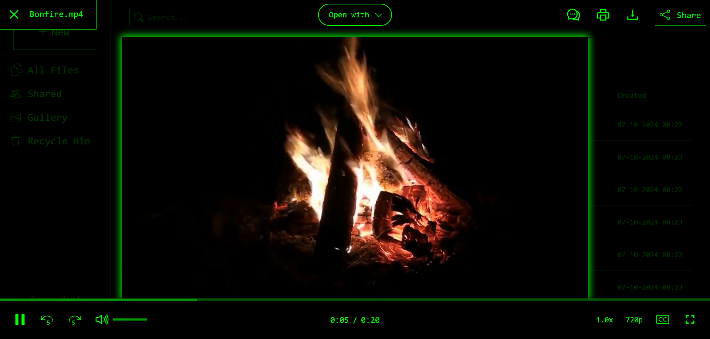
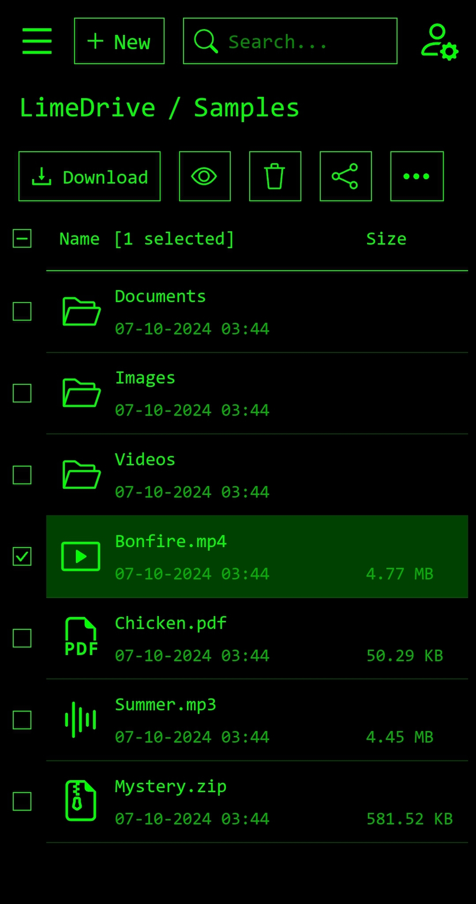
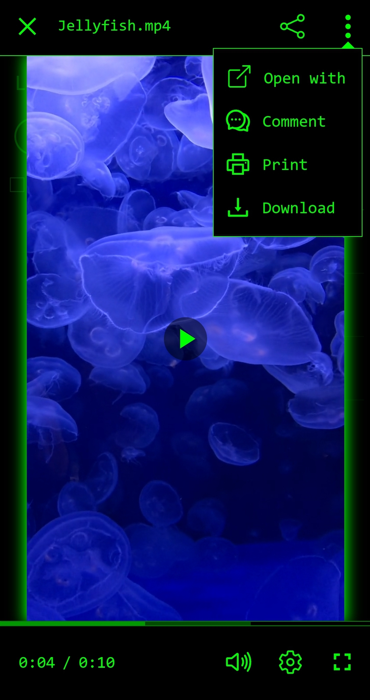

<h2 align="center">
    Test the Program: <a href="https://limedrive.net">LimeDrive.net</a>
</h2>

<h3 align="center">
    <a href="https://youtu.be/3P_LIRLbSy4">[Click to view video demo]</a>
</h3>

  
  
  

  
  
  

## ☁️ What's LimeDrive?

A robust cloud storage service that I solo-developed, with some areas surpassing Dropbox/Google Drive (particularly speed). I handled all complex architectural and scalability decisions, implementing them myself. Seamlessly manage and view files in LimeDrive's sleek retro UI - secure, fast, and performant.

> [!NOTE]
The LimeDrive codebase is partly closed-source, with only a fraction of its code available in this public repo (with inaccurate folder naming conventions) - this is because the code here is primarily meant for showcase (even for those with no experience with the technologies used) and may not function properly if you attempt to run it in your local environment with no other dependencies or changes. With that said, feel free to use what's here as inspiration.
> 
> If you're an employer, you can request to see more of the code during an interview.

## 📸 Screenshots With Captions

  

Click to expand

> UI borders may seem low quality in the screenshots. You can zoom in for better details. For more info and to see the features in action, go to the video demo above.

  
### File List - Clean UI

### File Viewer - Video and Controls

### File List - Detailed UI With Item Selection, Drag and Drop, and Upload Queue

### File Viewer - PDF and Shareable Link Generation

### Settings

### Login

### Responsive Design - Usable on Varied Screen Sizes

    
    

## 🛠️ Tech Stack

**Frontend** &nbsp;–&nbsp; React &nbsp;•&nbsp; TypeScript &nbsp;•&nbsp; HTML &nbsp;•&nbsp; CSS/Sass &nbsp;•&nbsp; Vite  &nbsp;•&nbsp; React Router &nbsp;•&nbsp; Cloudflare Pages

**Backend** &nbsp;–&nbsp; Laravel &nbsp;•&nbsp; PHP &nbsp;•&nbsp; SQL (PostgreSQL) &nbsp;•&nbsp; Docker &nbsp;•&nbsp; Cloudflare Workers &nbsp;•&nbsp; Render

**Other** &nbsp;–&nbsp; Playwright  &nbsp;•&nbsp; Axios &nbsp;•&nbsp; REST API &nbsp;•&nbsp; Cloudflare R2 (object storage) &nbsp;•&nbsp; Neon (DB host)

## 🔍 Current Features

⚡ **Cost and Performance Optimisation**
>Integrates zero-egress-fee object storage, presigned URLs, no-cost cloud service tiers, CDN, caching, lazy loading, data deduplication, automated cleanup, throttling, and usage limits - these lead to ***zero costs*** in data storage/processing, ***+63.3% faster*** API in production, being ***+2.7x faster*** than DropBox in service speed, and improved scalability and UX.

🚀 **Optimised Downloads** 
>A web worker, multiple data streaming packages, piped async iterables, and presigned URLs allow ***GBs of downloads*** to ***initiate immediately*** with ***only bytes of server load***.

🔒 **Security** 
>Client/server validation, encryption, hashing, proxy, WAF, SSL, CORS, and CSRF tokens.

🧪 **Automated Tests** 
>***E2E*** tests (Playwright), ***Unit*** tests (PHPUnit), and ***CI/CD*** (GitHub Actions).

🔑 **User Accounts** 
>Registration, login, account settings, sessions, and email verification/notifications.

📁 **File Storage and Management** 
>Folders, paths, drag & drop, downloading, link-share, and upload queue with robust management of varied situations like network errors, name conflicts, and cancelling.

👁️ **File Viewer** 
>Convenient viewer in-browser, supporting videos, images, PDFs, audio, and plain text. Includes shared views, printing, and custom video controls with fullscreen and keyboard shortcuts.

🔗 **Sharing** 
>Generate secure links to share files, providing effortless access/collaboration for recipients. Includes permission management. A Cloudflare worker verifies URLs via server-generated HMAC and IP.

🎨 **UX/UI** 
>A creative mix of bulletin board system/CLI themes with modern, responsive elements. Errors are more detailed/user-friendly than DropBox and UI is noticeably faster for a seamless experience.

♿ **Accessibility** 
>ARIA, keyboard navigation, shortcuts, clear labels, and semantic HTML.

✅ **Code Quality** 
>Improved type safety and documentation through use of TypeScript, PHPDoc/type hinting, and PHPStan - leading to a high reduction in runtime errors and time spent debugging them. 

⏲️ **Concurrency Control** 
>DB constraints, transactions, mutexes, and graceful exception handling allows for robust concurrent operations to avoid race conditions.

⚙️ **CI/CD Pipelines** 
>Separated development and production environments, with configurations on Render, Cloudflare, Docker, Github Actions, and Doppler - reducing the chance of downtime.
