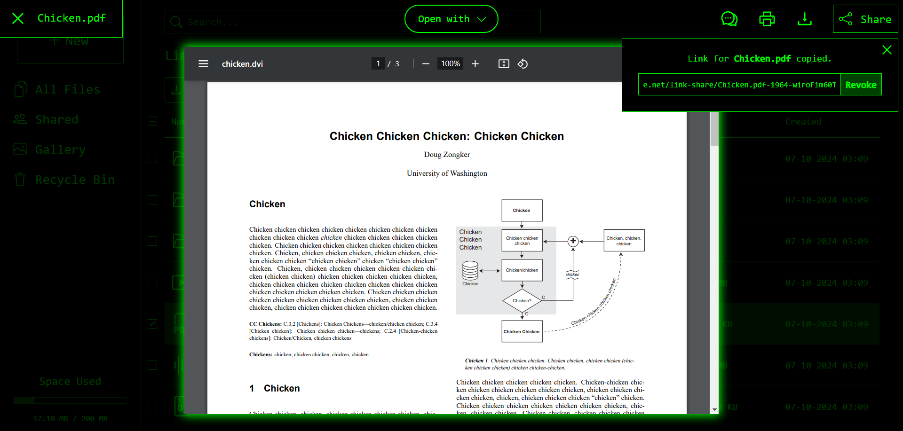

## Test the Program: [LimeDrive.net](https://limedrive.net)

## What's LimeDrive?
A robust cloud storage/file hosting service that I solo-developed for over a year, with some areas surpassing Dropbox/Google Drive (particularly speed). Seamlessly manage and view files in LimeDrive's sleek retro UI - secure, fast, and performant.

> [!NOTE]
The LimeDrive codebase is mostly closed-source, with only a fraction of its code available in this public repo. The code here is primarily meant for showcase and may not function properly if you attempt to run it in your local environment with no other dependencies. With that said, feel free to use what's here as inspiration.
> 
> If you're an employer, you can request to see more of the code during an interview.

## Screenshots

Click to expand

> UI borders may seem low quality in the screenshots. You can zoom in for better details.

  
### File List (Clean UI)

### File Viewer (Video and Controls)

### File List (Detailed UI)

### File Viewer (PDF and Shareable Link Generation)

### Settings

### Login

## Tech Stack
**Frontend** &nbsp;–&nbsp; React &nbsp;• TypeScript &nbsp;•&nbsp; HTML &nbsp;•&nbsp; CSS/Sass &nbsp;•&nbsp; Vite  &nbsp;•&nbsp; React Router &nbsp;•&nbsp; Cloudflare Pages

**Backend** &nbsp;–&nbsp; Laravel &nbsp;•&nbsp; PHP &nbsp;•&nbsp; SQL (PostgreSQL) &nbsp;•&nbsp; Docker &nbsp;•&nbsp; Cloudflare Workers &nbsp;•&nbsp; Render

**Other** &nbsp;–&nbsp; Playwright  &nbsp;•&nbsp; Axios &nbsp;•&nbsp; REST API &nbsp;•&nbsp; Cloudflare R2 (object storage) &nbsp;•&nbsp; Neon (DB host)

## Current Features
**Cost and Performance Optimisation** &nbsp;–&nbsp; Integrates zero-egress-fee object storage, presigned URLs, no-cost cloud service tiers, CDN, caching, lazy loading, data deduplication, automated cleanup, throttling, and usage limits - these lead to ***zero costs*** in data storage/processing, ***+63.3% faster*** API in production, being ***+2.7x faster*** than DropBox in service speed, and improved scalability and UX.

**Security** &nbsp;–&nbsp; Client/server validation, encryption, hashing, proxy, WAF, SSL, CORS, CSRF tokens.

**Automated Tests** &nbsp;–&nbsp; E2E tests (Playwright), Unit tests (PHPUnit), CI/CD (GitHub Actions).

**User Accounts** &nbsp;–&nbsp; Registration, login, account settings, sessions, and email verification/notifications.

**File Storage and Management** &nbsp;–&nbsp; Folders, paths, drag & drop, downloading, link-share, and upload queue with robust management of varied situations like network errors, name conflicts, and cancelling.

**File Viewer** &nbsp;–&nbsp; Convenient viewer in-browser, supporting videos, images, PDFs, audio, and plain text. Includes shared views, printing, and custom video controls with fullscreen and keyboard shortcuts.

**Sharing** &nbsp;–&nbsp; Generate secure links to share files, providing effortless access/collaboration for recipients. Includes permission management. Cloudflare worker verifies URLs via server-generated HMAC and IP.

**Accessibility** &nbsp;–&nbsp; ARIA, keyboard navigation, shortcuts, clear labels, and semantic HTML.

**UX/UI** &nbsp;–&nbsp; A creative mix of bulletin board system/CLI themes with modern, responsive elements. Errors are more detailed/user-friendly than DropBox and UI is noticeably faster for a seamless experience.

**Code Quality** &nbsp;–&nbsp; Excellent type safety and documentation through use of TypeScript, PHPDoc/type hinting, and PHPStan - leading to a high reduction in runtime errors and time spent debugging them. 

**Concurrency Control** &nbsp;–&nbsp; DB constraints, transactions, mutexes, and graceful exception handling allows for robust concurrent operations to avoid race conditions.

**CI/CD Pipelines** &nbsp;–&nbsp; Separated development and production environments, with configurations on Render, Cloudflare, Docker, Github Actions, and Doppler - reducing the chance of downtime.
